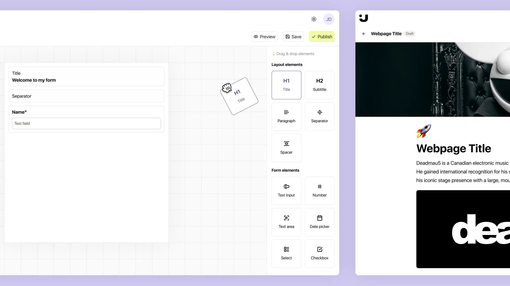

# PageJet — Forms and Page Builder



[](https://nextjs.org/)
[](https://www.typescriptlang.org/)
[](https://tailwindcss.com/)
[](https://dndkit.com/)
[](https://www.postgresql.org/)
[](https://www.prisma.io/)


PageJet is a user-friendly forms and page builder web app built with Next.js, TypeScript, Dnd-Kit, PostgreSQL, Prisma, and Tailwind CSS.

## Overview 🦄

PageJet provides an intuitive interface for users to create forms and pages effortlessly. With its drag-and-drop functionality and customizable components, users can design and publish professional-looking forms and pages in no time.

## Features ✨

- ✒️ **Drag-and-Drop Interface:** Easily build forms and pages by dragging and dropping components onto the canvas.
- 🖼️ **Customization:** Customize the look and feel of forms and pages, ensuring flexibility and consistency in design.
- 🐘 **Data Management:** Utilize PostgreSQL database and Prisma ORM for efficient data storage and management.
- 👨‍💻👩‍💻 **Type Safety:** Develop with confidence using TypeScript for static typing and improved developer experience.
- 🔍 **SEO Optimization:** Benefit from server-side rendering and SEO-friendly features provided by Next.js for better search engine visibility.

## Installation 🛠️

1. Clone the repository:

   ```bash
   git clone https://github.com/seifeldinio/pagejet.git
   ```

2. Navigate to the project directory:

   ```bash
   cd pagejet
   ```

3. Install dependencies:

   ```bash
   npm install
   ```

4. Set up the PostgreSQL database and configure Prisma according to the [documentation](https://www.prisma.io/docs/getting-started/setup-prisma/start-from-scratch).

5. Start the development server:

   ```bash
   npm run dev
   ```

6. Open your browser and visit [http://localhost:3000](http://localhost:3000) to access PageJet.

## Usage ✍️

- **Development:** Customize and extend PageJet according to your requirements by modifying the source code in the `app` and `components` directories.
- **Production:** Build the app for production using `npm run build`, and deploy the generated `build` folder to your hosting platform.

## Contributing 🤝

Contributions are welcome! Please feel free to submit issues and pull requests.

## License ⚖️

This project is licensed under the [MIT License](LICENSE).
